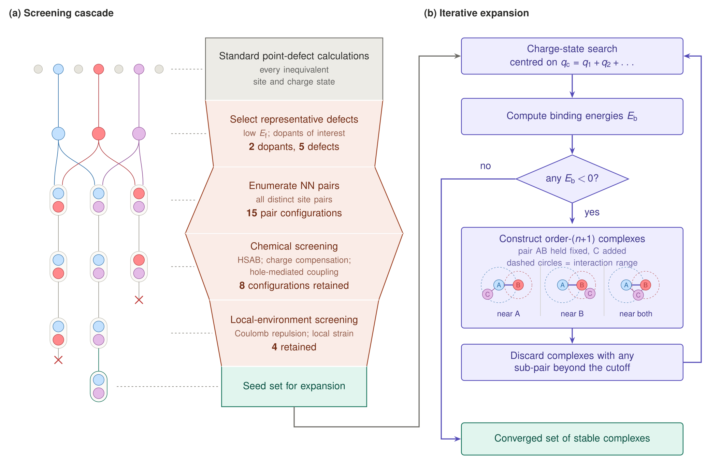

# codopex

[](https://github.com/Kanrw/codopex/actions/workflows/ci.yml)
[](https://github.com/Kanrw/codopex)
[](LICENSE)
[](https://github.com/astral-sh/ruff)

Generate symmetry-inequivalent co-doping defect-pair and higher-order
complexes in a host supercell.

**codopex** automates the configurational enumeration behind co-doping
studies: given a pristine supercell and a set of substitution reactions
(e.g. Cu at Pb sites, S at O sites), it

1. discovers every inequivalent *single-defect type* (a dopant on one
   pristine site-symmetry class, labelled `{dopant}_{host}_{symmetry}`,
   e.g. `Cu_Pb_C3v`),
2. enumerates all symmetry-inequivalent *defect pairs* and returns the
   nearest-neighbour (default) or next-nearest-neighbour complexes of every
   pair combo (with repetition, including `A+A`),
3. expands any pair by a third dopant into *triple complexes* placed near
   A, near B, or near both (`nearA_farB`, `nearB_farA`, `both_nn`), at the
   nearest or next-nearest shell.

Everything is computed in memory with pymatgen/spglib — no external
enumerator, no file side effects.  Structures keep the pristine site order;
export helpers write POSCAR trees and manifests when you need VASP inputs,
and results can be saved/loaded as JSON to split the two phases across
sessions or machines.  The same workflows are available from the command
line (`codopex --help`).



*The workflow codopex supports (Fig. 5 of the accompanying paper): (a) a
screening cascade that reduces the pair space to a seed set, and (b) the
iterative expansion of bound pairs into higher-order complexes.*

## Installation

```bash
git clone https://github.com/Kanrw/codopex.git
cd codopex
pip install -e .          # library
pip install -e ".[dev]"   # with test/lint tooling
```

Requires Python ≥ 3.10, `pymatgen>=2024` and `numpy`.

## Quick start

```python
import codopex as cp

# Phase 1: nearest-neighbour pairs among Cu@Pb, S@O and S@P
pairs = cp.generate_pairs(
    "CONTCAR",  # pristine supercell (Structure or path)
    [("Pb", "Cu"), ("O", "S"), ("P", "S")],
)

pairs.type_labels
# e.g. ['Cu_Pb_D3d', 'Cu_Pb_C3v', 'S_O_C3v', 'S_O_Cs', 'S_P_C3v']
# canonical order follows the input site order; pass type_order=[...] to
# reproduce a hand-picked ordering

for row in cp.pair_rows(pairs):
    print(row["combo"], row["shell"], row["dist_AB"])

# include the next-nearest shell as well
pairs = cp.generate_pairs("CONTCAR", [("Pb", "Cu"), ("O", "S"), ("P", "S")], shells="nnn")

# Phase 2: expand one pair by an additional S@O dopant
triples = cp.generate_triples(
    pairs,
    pair="Cu_Pb_C3v+S_O_C3v",
    third=[("O", "S")],  # optional; default: all reactions of the pairs
)
for row in cp.triple_rows(triples):
    print(row["combo"], row["criterion"], row["d_AC"], row["d_BC"])

# ... or expand every parent pair in one call
batch = cp.generate_all_triples(pairs)
for parent in batch:
    print(parent, len(batch[parent].complexes), "triple combos")
batch.skipped  # parent pairs without a representative in the chosen shell
```

### Saving and loading results

Phase 1 and phase 2 do not have to run in the same process:

```python
cp.io.save(pairs, "runs/pairs.json.gz")  # gzip when the path ends in .gz
pairs = cp.io.load("runs/pairs.json.gz")  # fully equivalent, all candidates
```

`save()`/`load()` accept pair results, triple results and the batch result
of `generate_all_triples()`, and keep every structure, distance, degeneracy
and stat.  The file records the codopex version and a format version.

## Command line

```bash
# Phase 1: write the POSCAR tree, a manifest and a reloadable result
codopex pairs CONTCAR -r Cu@Pb -r S@O -r S@P --shells nnn \
    --out runs/pairs --save runs/pairs/pairs.json.gz

# Phase 2: expand every pair (or selected ones) by an additional S@O dopant
codopex triples --load-pairs runs/pairs/pairs.json.gz --third S@O \
    --out runs/triples --save runs/triples/triples.json.gz

# Label the defects of an externally produced structure
codopex classify bulk.vasp defect.vasp
```

Reactions are written `DOPANT@HOST` (`Cu@Pb` = Cu on Pb sites) and can be
repeated.  Without `--load-pairs`, `triples` rebuilds phase 1 from a
structure and reactions.  `--write-all` also dumps every candidate under
`work_{combo}/`; `--csv FILE` writes the manifest to an explicit path.

## What you get back

`PairsResult` / `TriplesResult` hold the structures themselves together
with full metadata:

| attribute | content |
|---|---|
| `.types` | discovered `DefectType`s in canonical order (reactions in the order given, then site order within a reaction) |
| `.bases` | one base structure per type: the configuration whose dopant sits closest to the supercell center |
| `.complexes` | per combo: `.candidates` (every inequivalent configuration with distances, degeneracy/orbit size and structure) and `.shells` / `.selections` (the representatives) |
| `.stats` | per-job configuration counts, skipped combos |

Every candidate records its **degeneracy** (orbit size of the substituted
site), which is the weight needed for thermodynamic averages.

### Exporting for VASP runs

```python
cp.io.export_pairs(pairs, "out_pairs", write_all=False)
cp.io.export_triples(triples, "out_triples")
cp.io.write_rows_csv(cp.pair_rows(pairs), "pairs.csv")
```

The export mirrors the layout of the original notebooks:
`single_defect/{type}/POSCAR`, `{combo}/{nn|nnn}/POSCAR`,
`{combo}/{criterion}/POSCAR`, with an unindexed `POSCAR` copy per
representative and all candidates under `work_{combo}/` when
`write_all=True`.  POSCAR files are written species-grouped by atomic
number (VASP convention).

## How it works

* **Enumeration engine** — a single substitution on a base structure is
  symmetry-inequivalent up to the space group of that base; the
  inequivalent configurations are exactly the orbits of the candidate host
  sites under spglib.  Orbit representatives (smallest site index) give a
  deterministic order.  This reproduces the SAGAR enumeration used in the
  original workflow (see `docs/regression.md`).
* **Type discovery** — host-site classes are defined by the pristine site
  symmetry (Schoenflies) plus a Wyckoff tag; classes sharing a symmetry
  label stay distinct types.  Labels follow the original convention
  `{dopant}_{host}_{symmetry}`.
* **Shells** — distances are clustered with a 0.05 A tolerance; "nn" is
  the first cluster, "nnn" the second (a new shell starts past
  start + 0.05 A).  Within a shell, several inequivalent configurations may
  exist; codopex keeps one deterministic representative per (combo, shell)
  and exposes all candidates.
* **Pair combos** — all `combinations_with_replacement` over the types
  (so `A+A` pairs are included and require at least two sites of the type).
* **Triples** — a triple whose sorted types are `(i, j, c)` is generated
  from the representative of its *canonical parent pair* `(i, j)`.  The
  placement criteria of the original workflow select one representative per
  criterion; all configurations are kept in `.candidates` with d_AC/d_BC.

A/B convention: A is the pair's base-type dopant, B the added one; C is
the third dopant.  Site order is never changed: site `i` of any returned
structure is pristine site `i` with (possibly) a different element.

## Testing and development

```bash
pip install -e ".[dev]"
pytest                      # test suite
pytest --cov=codopex        # with coverage
ruff check . && ruff format --check .
mypy
```

* `tests/test_synthetic.py` — mechanics on small crystals (shells, base
  rule, criteria semantics, exports, edge cases).
* `tests/test_ppo_regression.py` — regression against the original
  SAGAR-based workflow on the Pb3(PO4)2 Cu–S case (`tests/data/ppo`).
  See `docs/regression.md` for what is exact, what differs by design, and
  why.
* `tests/test_persistence.py`, `tests/test_cli.py` — save/load round trips,
  the batch API and the command line.

Contributions are welcome — see `CONTRIBUTING.md`.

## Citation

codopex accompanies *An Efficient Strategy for Identifying Stable Co-doping
Configurations in Complex Systems* (Wang, Yao, He, Zhao; manuscript under
review).  Machine-readable metadata is in [`CITATION.cff`](CITATION.cff)
(GitHub's "Cite this repository" button); journal and DOI will be added
there once the paper is published.

## Limitations

* Only *substitutional* complexes are enumerated.  `classify_defects`
  labels substitutions and vacancies, but a defect site without a pristine
  counterpart (an interstitial atom) is reported as an error: every site of
  a codopex-generated structure corresponds to a pristine site.
* The input is a single pristine supercell; codopex does not build or
  enlarge supercells and does not check that the cell is large enough for
  the defects of interest (it warns only when a site class is exhausted).
* Representative *selection inside* an equal-distance shell is
  deterministic but not unique; a different (equally valid) configuration
  may be picked than an earlier SAGAR-based run (see `docs/regression.md`).
